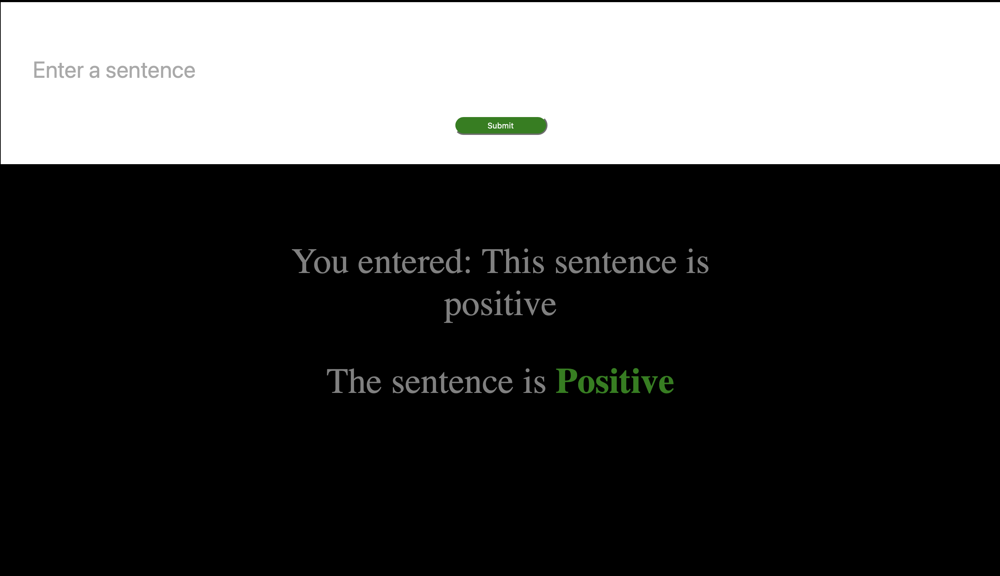
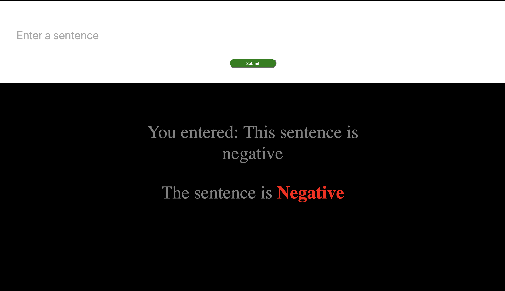

# Sentiment Lab

A small Python sentiment-analysis workspace with two deliberately separate paths:

1. A lightweight Flask demo powered by TextBlob polarity.
2. An experimental IMDB LSTM training script for exploring a learned classifier.

The distinction matters: the web interface currently serves the fast TextBlob analyzer, while `predictor.py` is a standalone model-training experiment.

## Web demo

The Flask app accepts a sentence, calculates its polarity, and renders a positive or negative result.





## Run the Flask app

```bash
python3 -m venv .venv
source .venv/bin/activate
pip install -r requirements.txt
python app.py
```

Open [http://localhost:5000](http://localhost:5000).

## How the paths differ

| File | Approach | Used by the web app? |
| --- | --- | --- |
| `app.py` | TextBlob lexicon-based polarity | Yes |
| `predictor.py` | Keras LSTM trained on the IMDB dataset | No—standalone experiment |

## Project layout

```text
app.py              Flask routes and TextBlob classification
predictor.py        Experimental IMDB model-training script
templates/          Result form and page markup
static/             Interface styling
positive.png        Positive result example
negative.png        Negative result example
```

## Limitations

- The live classification is binary: neutral scores fall into the negative branch.
- TextBlob sentiment is general-purpose and can miss sarcasm, context, and domain-specific language.
- The training experiment is not connected to the Flask application or evaluated in this repository.

This project is best read as a compact comparison point between a ready-made analyzer and a learned-model experiment, not as an accuracy benchmark.
